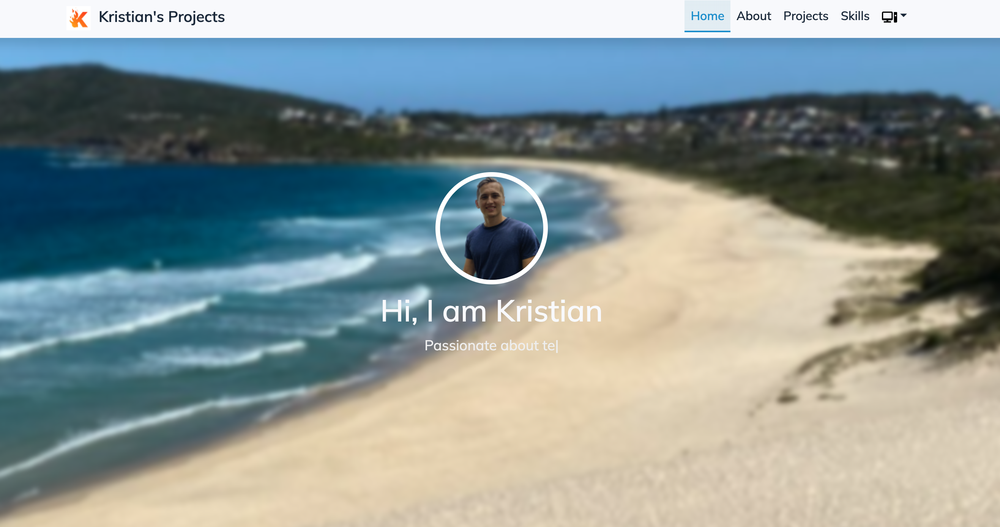

# Kristian's Portfolio Website

Personal portfolio website built with Hugo and the Toha theme, showcasing projects, experience, and publications.

## 🚀 Live Site

The site is automatically deployed via GitHub Actions to GitHub Pages at: https://kristian-94.github.io



## 🛠️ Stack

- **Static Site Generator**: Hugo
- **Theme**: [Toha](https://github.com/hugo-toha/toha)
- **Hosting**: GitHub Pages
- **Deployment**: GitHub Actions

## 📋 Prerequisites

- Hugo v0.110.0 (pinned version - **important**: newer versions does break compatibility)
- Git

## 🏗️ Local Development

### Installation

1. **Install Hugo** (version 0.110.0 specifically):
   ```bash
   # Download from Hugo releases
   # https://github.com/gohugoio/hugo/releases/tag/v0.110.0
   ```

2. **Clone the repository**:
   ```bash
   git clone https://github.com/kristian-94/kristian-94.github.io.git
   cd kristian-94.github.io
   ```

3. **Initialize theme submodule**:
   ```bash
   git submodule update --init --recursive
   ```

### Development Server

Start the development server:
```bash
hugo serve
```

The site will be available at `http://localhost:1313`

For development with draft content:
```bash
hugo serve -D
```

### Building for Production

Build the static site:
```bash
hugo --minify
```

The generated site will be in the `public/` directory.

## 📁 Project Structure

```
├── archetypes/          # Content templates
├── assets/             # Images and resources
├── content/            # Site content
│   ├── blog/           # Blog posts
│   ├── notes/          # Technical notes
│   ├── projects/       # Project showcases
│   └── publications/   # Publications and talks
├── data/               # Data files (YAML/JSON)
├── layouts/            # Custom templates
├── static/             # Static files
├── themes/toha/        # Theme submodule
├── config.yaml         # Hugo configuration
└── public/             # Generated site (ignored in git)
```

## 🔧 Configuration

Key configuration files:
- `config.yaml` - Main Hugo configuration
- `data/` - Content data in YAML format
  - `author.yaml` - Author information
  - `sections/` - Section-specific content

## 🚢 Deployment

### Automatic Deployment (GitHub Actions)

The site automatically deploys when changes are pushed to the `main` branch using GitHub Actions:

- **Workflow**: `.github/workflows/gh-pages.yml`
- **Hugo Version**: Pinned to v0.110.0
- **Trigger**: Push to `main` branch
- **Target**: `gh-pages` branch on GitHub Pages

### Manual Deployment

If you need to deploy manually:

1. Build the site:
   ```bash
   hugo --minify
   ```

2. The `public/` directory contains the generated site ready for deployment

## ⚠️ Important Notes

- **Hugo Version**: The site is pinned to Hugo v0.110.0 due to compatibility issues with newer versions
- **Theme**: Uses the Toha theme as a git submodule
- **Mermaid**: Custom Mermaid diagram rendering is configured in layouts

## 🎨 Customization

### Adding Content

- **Projects**: Add markdown files to `content/projects/`
- **Blog Posts**: Add markdown files to `content/blog/`
- **Publications**: Add markdown files to `content/publications/`

### Updating Data

- **Experience**: Edit `data/sections/experiences.yaml`
- **Skills**: Edit `data/sections/skills.yaml`
- **Education**: Edit `data/sections/education.yaml`

### Theme Customization

- Custom layouts in `layouts/`
- Additional CSS in `assets/`
- Custom shortcodes in `layouts/shortcodes/`

## 🔍 SEO & Analytics

- Google Analytics configured (ID: G-H4LBG7NDFZ)
- Sitemap automatically generated
- RSS feed enabled

## 📞 Contact

For questions or suggestions, please open an issue on GitHub.