### Problem
I have an air conditioner that I want to control remotely. Turn it on before I get home, or from anywhere, using my phone. It's not 'smart', doesn't have those features built in. 
### Approach
The idea is to capture the IR (infra-red) signal from the air con's remote, and be able to output that again on demand. We don't need to decode the signal or understand how fujitsu encodes things. 

We need an IR receiver, to capture the raw data. Once we have that, we don't need the receiver anymore. Then we just need the IR emitter to output the captured codes.
### Hardware Implementation 
An Arduino is a microcontroller board. It's really good at input and output of electronic signals. The first thing was to capture the signal using the arduino and IR receiver. The serial monitor outputs over USB to the computer everything that is happening on the arduino.

The whole build process worked fine, pretty simple. Arduino IDE works well to compile and upload code. The IR receiver worked well to capture the output of the remote. Everything ran at a frequency of 38 KHz as is pretty normal for air conditioners. 

Here it is in action: 

<video width="600" controls>
  <source src="/projects/videos/aircon/air-con-capture.webm" type="video/webm">
  Your browser does not support the video tag.
</video>

The way this works is the IR led turns on and off very quickly. The 'long' pulses are seen as 1, and short pulses as 0, and in that way it encodes information. It also has a certain tolerance around the pulse time, since it's so short it naturally varies, about 350-450us for short pulses, 1250 for long ones. The 3200,1650 is a spacer pulse, to signal the start/end of a signal.


##### Issue 1: Running out of memory
The captured commands are so long, that the Arduino did not let me upload that compiled script. We were running out of SRAM, ie. Static Random Access Memory that is really fast but limited. 
Claude got around this by storing the constants in program memory instead, which was really nice to breeze past that issue. 
```
const uint16_t rawData_OFF[] PROGMEM = {...};
```
##### Issue 2: HIGH/setting command did not work
**Problem**: OFF command transmitted successfully, but ON command failed
Claude told me it was a power/timing issue with longer signals based on research about 750+ element AC protocol problems. It told me about timing drift and some in depth technical stuff but that turned out to be a red herring. But Claude doesn't know everything... 

But it did let me see timing drift with some python scripts, comparing the remote to my signal. 


Cool looking chart.. but not the source of the issue, the drift is pretty minimal as we can see. 

I found on the docs of the IR remote library we're using to capture that the buffer length was likely too low: https://github.com/Arduino-IRremote/Arduino-IRremote?tab=readme-ov-file#compile-options--macros-for-this-library as it says: 
> 100 is sufficient for _regular_ protocols of up to 48 bits, but for most air conditioner protocols a value of up to 750 is required

The ON signal was being truncated at exactly 200 elements due to a small buffer size. 
```js
#define RAW_BUFFER_LENGTH 400
```

Air cons send the full state of the air con every time, like the temp, fan speed, mode, timers. So this is a pretty long signal, and took 260 pulses, which when truncated won't do anything.  
##### Issue 3: ON command is different to 'set to HIGH'
Even with the full captured command, it still wouldn't turn on, but it would set to HIGH if the unit was already on. It turns out that there is a different command to turn on AND set to high, rather than just set to high. Once I did a recapture, that worked. I compared the two captures and could see a few bits changed from 0 -> 1 so that made me try the new signal. 

Now the IR emitter is working great, and controls the air con. But we're controlling it by having it plugged into the computer and manually telling it to emit each signal. How can we control it remotely? 

### Remote control
An ESP32 is a small wifi enabled microcontroller. It's kind of like an arduino in that way, but it also has wifi connectivity which is perfect for this. It works similar to the arduino as well in that we just compile and upload code to it through the arduino IDE. 


It's some C++ code that runs on the ESP32 to create a simple web server. This allows us to receive HTTP GET requests.

```
#include <WebServer.h>
uint16_t acOff[116] = {3200,1650,350,450,...};
uint16_t acOnHigh[259] = {3200,1650,350,450,...};
void setup() {
   server.on("/on", handleOn);
   server.on("/off", handleOff);
}
```
The `WebServer` library is doing all that for us. Now we just have to do GET requests to the IP address of the esp32 to control it.


### Final mounting (for now)


Could print an enclosure/put it further away.. it works for now. 

Simple web page hosted on a pi, that is the only entrypoint on the home network. Using Cloudflare tunnel we don't have to open ports on the router itself. This server now simply calls `192.168.1.115/on` and `192.168.1.115/off`. 


# Learnings

### How air con, IR, pi, arduino and esp32 work
It was really cool seeing the real captured IR data coming through on the serial monitor. Normally using a remote you just wouldn't think about what is happening on a lower level like that, and it was cool to see the invisible signal being made visible. 
I understand more what a pi is good for, more of a server/full computer, vs arduino/esp32 which is for controlling components directly. Working together in this system is a cool way to allow each to play to its strengths. 

```mermaid
%%{init: {'theme':'base', 'themeVariables': {'background': '#ffffff', 'primaryColor': '#ffffff', 'primaryTextColor': '#000000'}}}%%
graph LR
    USER["📱 User<br/>iPhone Browser"]
    PI["🥧 Raspberry Pi<br/>Flask Server"]
    ESP["💡 ESP32<br/>192.168.1.115<br/>HTTP + IR"]
    AC["❄️ Air Conditioner"]
    
    USER ==>|"HTTPS<br/>ac.ringertech.org"| PI
    PI ==>|"HTTP GET<br/>/on or /off"| ESP
    ESP ==>|"38kHz IR Signal"| AC
    
    classDef deviceStyle fill:#f8f9fa,stroke:#6c757d,stroke-width:2px,color:#000,rx:10,ry:10
    
    class USER,PI,ESP,AC deviceStyle
```



### Claude
It is really helpful to have claude as a fallback, rubber duck debugger and helper. It felt like I couldn't really get stuck too much, I always had a knowledgable tool to push through any hiccups. It makes the whole project smoother, and more than that just reduces anxiety and gives confidence. I know I could do many other projects and it feels more exciting and fun having that tool to unstick yourself. I also could ask many more follow up questions about how the circuit, code, and components worked. 
Of course, having it write the initial arduino code was also super helpful because I don't know all the intricacies of the syntax. 

Having said that, it made me get extra stuck when the signal was being truncated to 200, suggesting timing/other issues... I think without claude I would have figured that out faster. 

On to the next one...
